.. -----------------------------------------------------------------------------
   ..
   ..  Filename       : index.rst
   ..  Author         : Huang Leilei
   ..  Status         : phase 000
   ..  Created        : 2025-02-18
   ..  Description    : description about 第00讲 - 课程简介
   ..
.. -----------------------------------------------------------------------------

第00讲 - 课程简介
--------------------------------------------------------------------------------

学习意义
........................................
.. image:: 幻灯片2.JPG
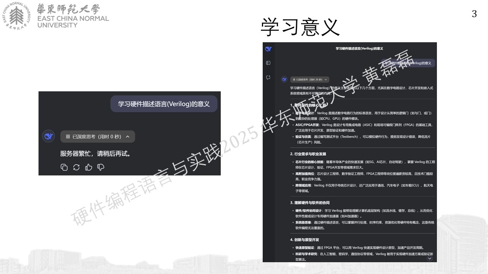
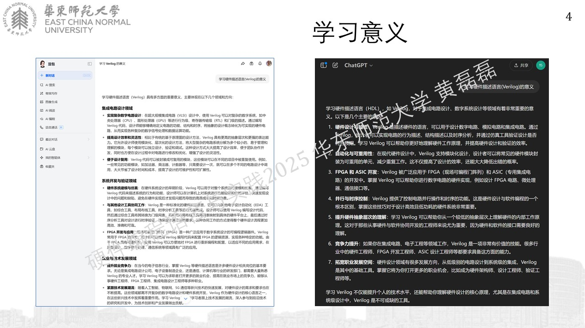
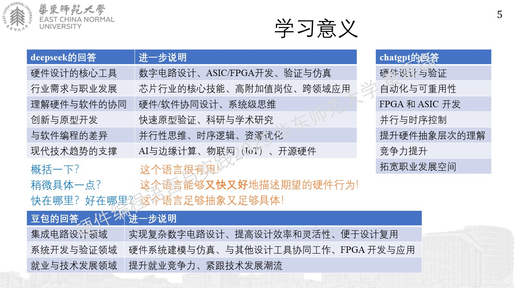
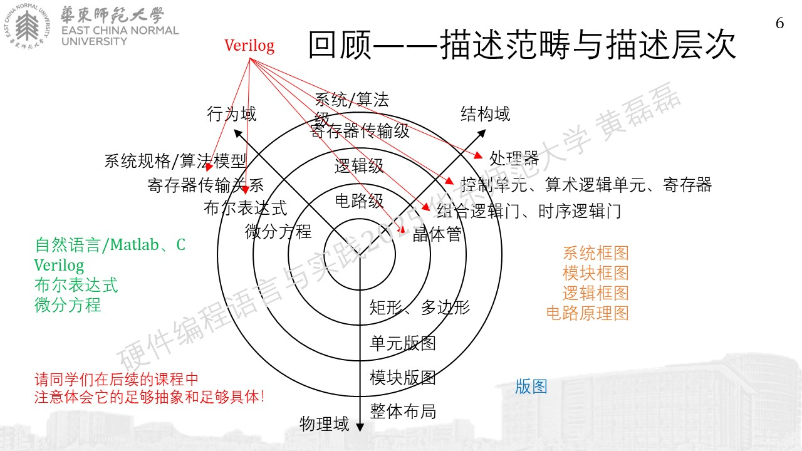
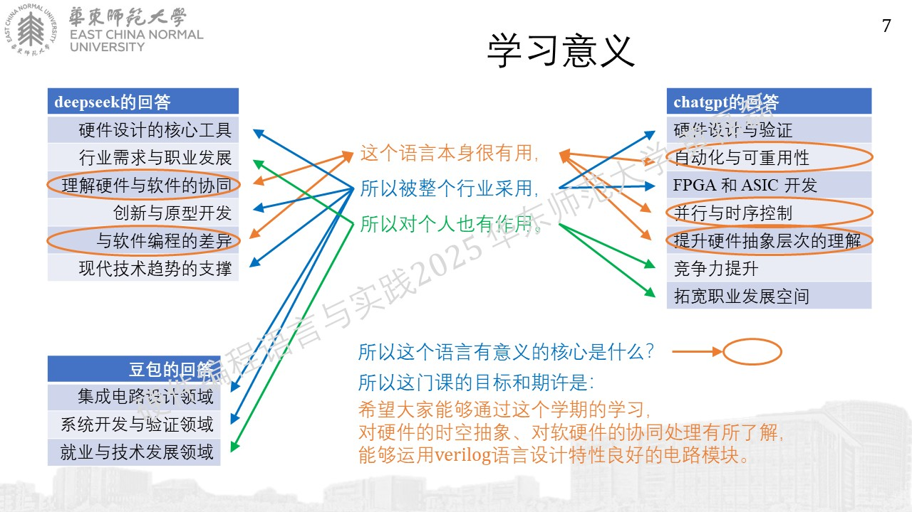

课程内容
........................................
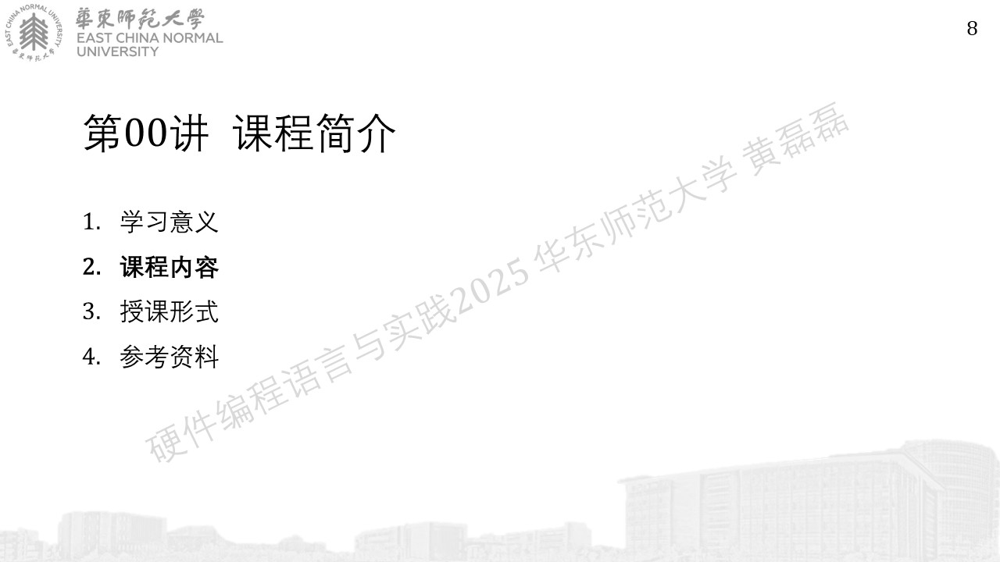
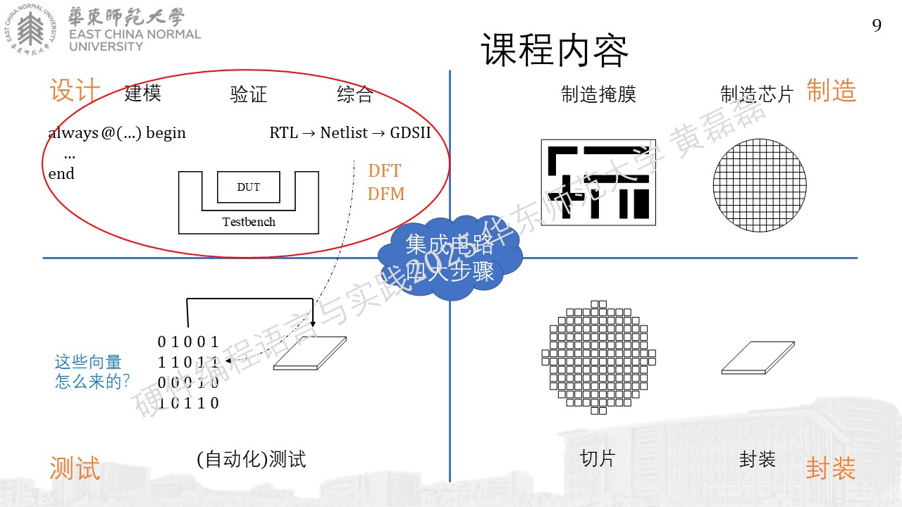
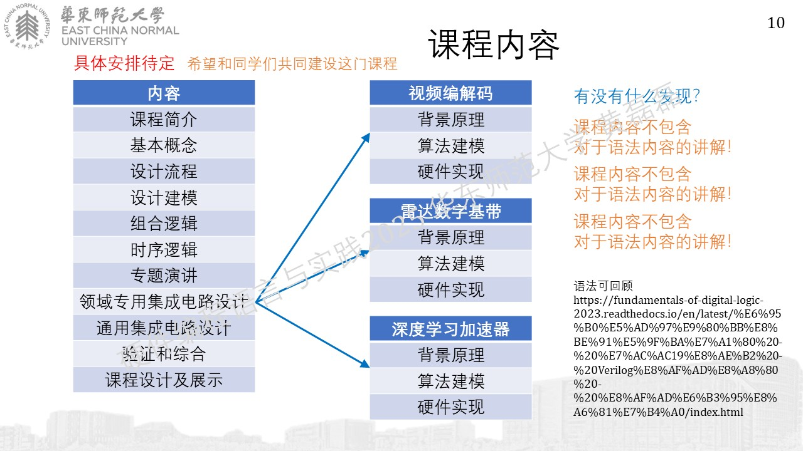

https://fundamentals-of-digital-logic-2023.readthedocs.io/en/latest/%E6%95%B0%E5%AD%97%E9%80%BB%E8%BE%91%E5%9F%BA%E7%A1%80%20-%20%E7%AC%AC19%E8%AE%B2%20-%20Verilog%E8%AF%AD%E8%A8%80%20-%20%E8%AF%AD%E6%B3%95%E8%A6%81%E7%B4%A0/index.html

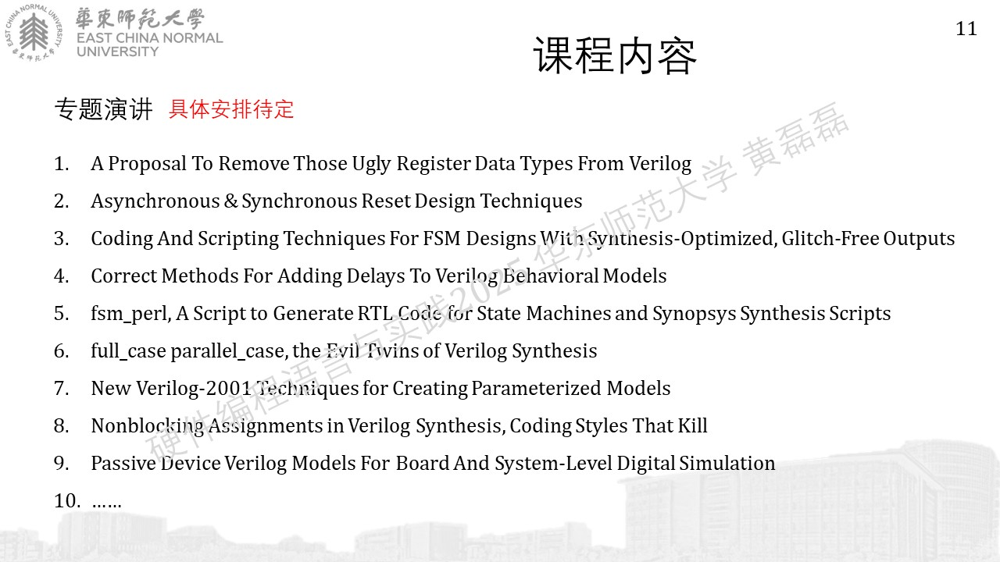
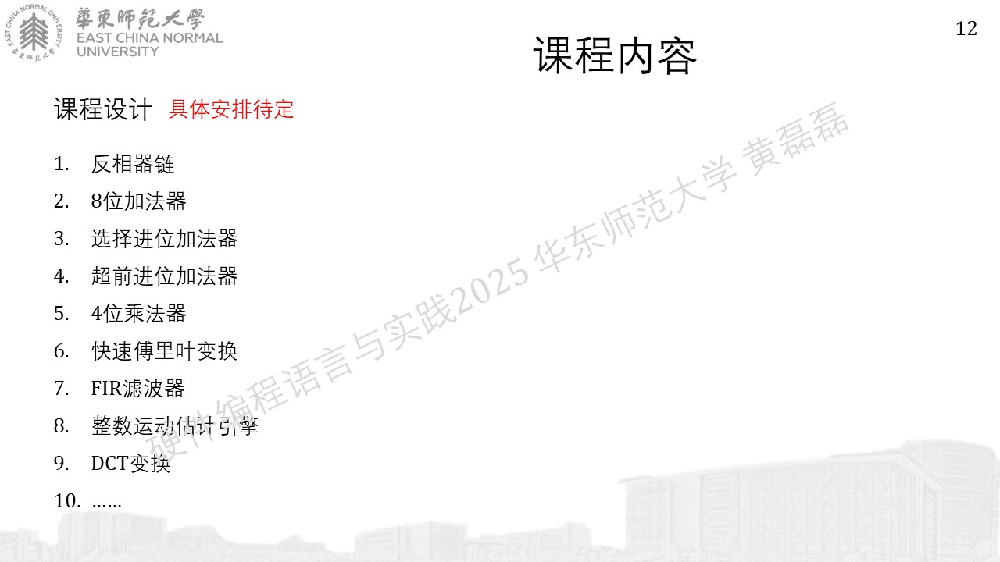

授课形式
........................................

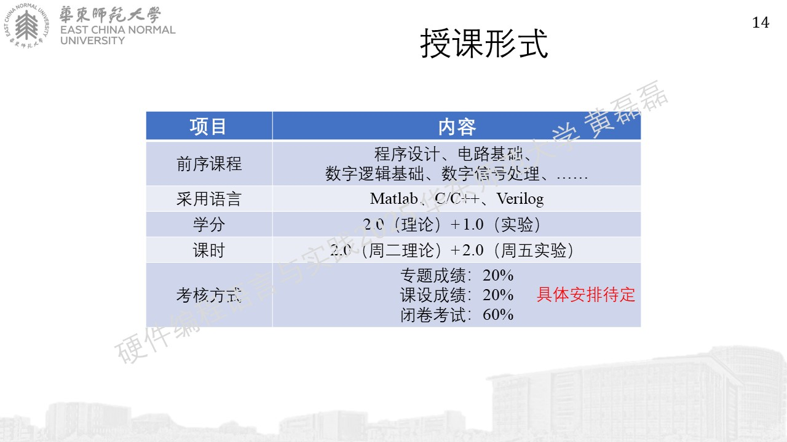

参考资料
........................................

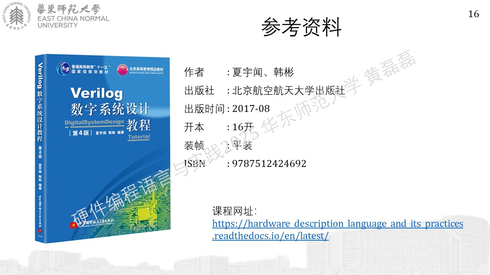

https://hardware_description_language_and_its_practices.readthedocs.io/en/latest/

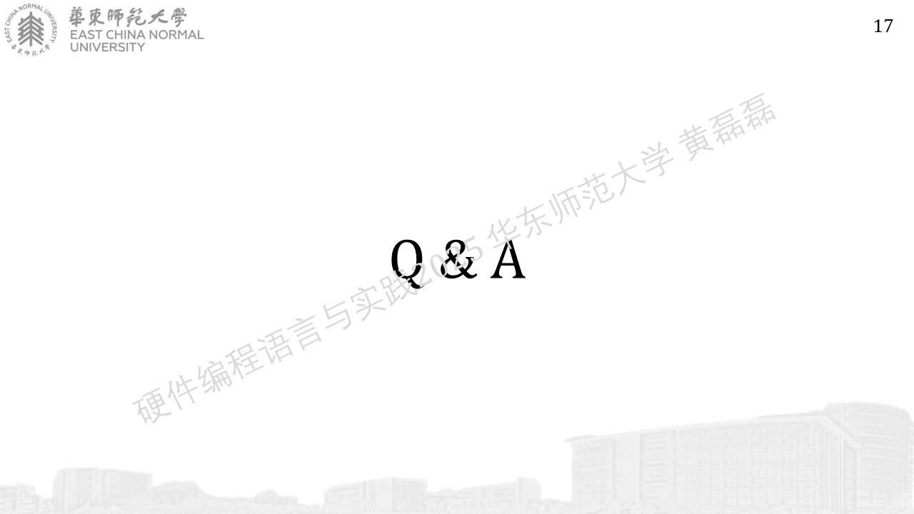
