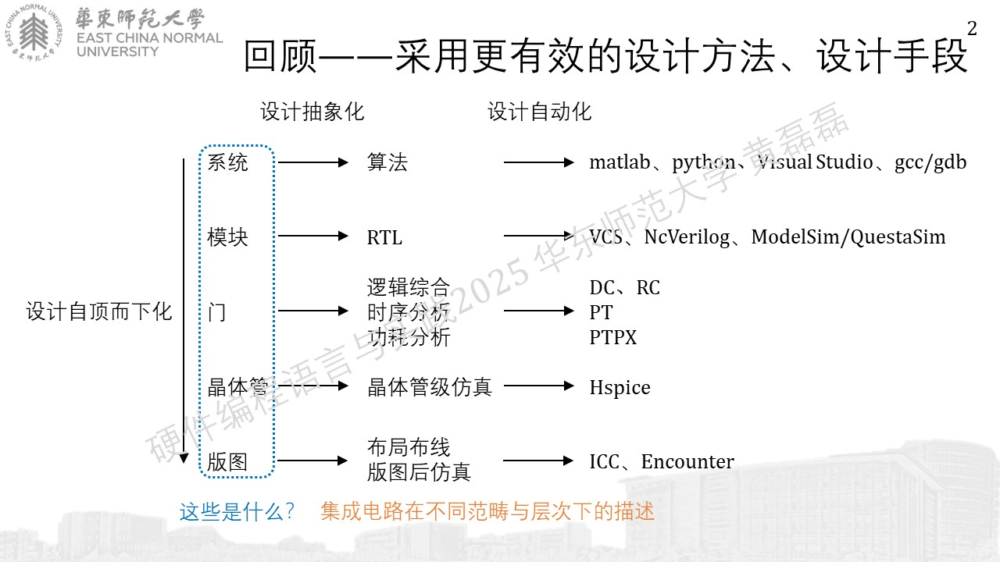
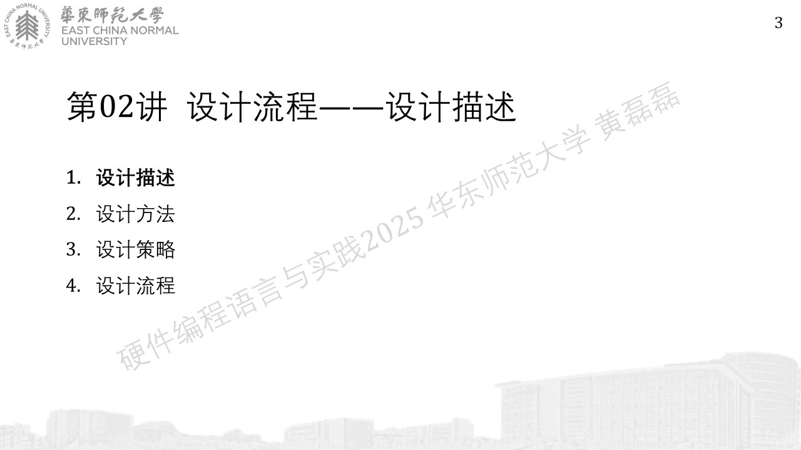
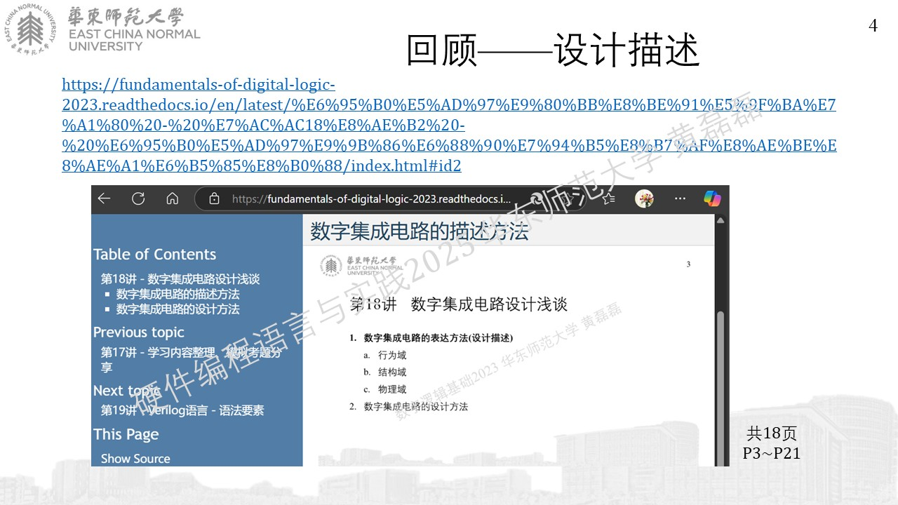
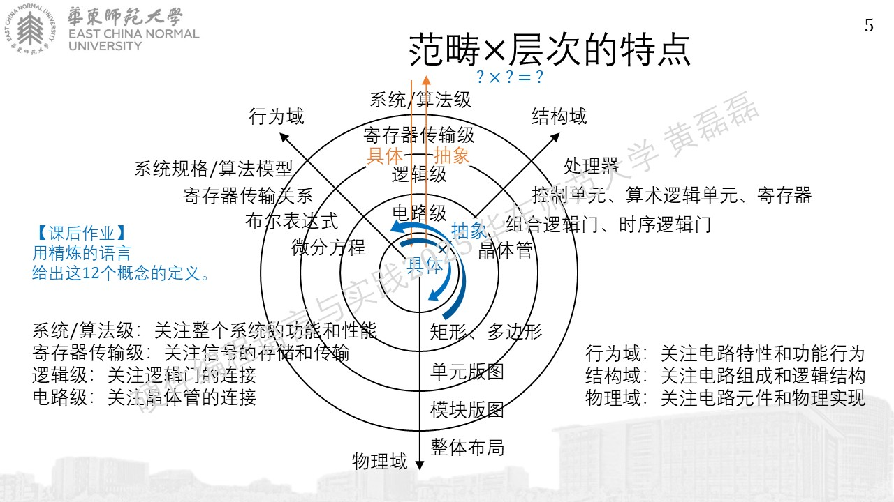
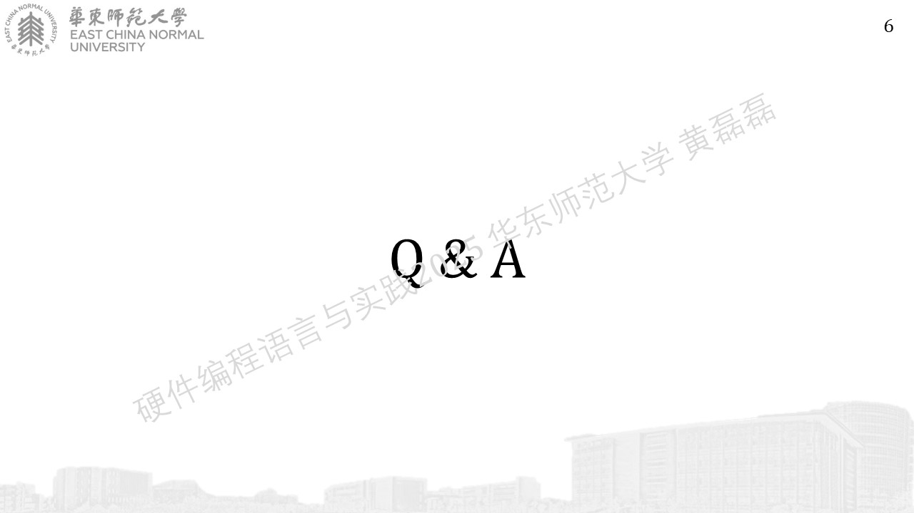

.. -----------------------------------------------------------------------------
   ..
   ..  Filename       : index.rst
   ..  Author         : Huang Leilei
   ..  Status         : phase 000
   ..  Created        : 2025-02-18
   ..  Description    : description about 第02讲 - 设计流程 - 设计描述
   ..
.. -----------------------------------------------------------------------------

第02讲 - 设计流程 - 设计描述
--------------------------------------------------------------------------------

引子
........................................

设计描述
........................................

https://fundamentals-of-digital-logic-2023.readthedocs.io/en/latest/%E6%95%B0%E5%AD%97%E9%80%BB%E8%BE%91%E5%9F%BA%E7%A1%80%20-%20%E7%AC%AC18%E8%AE%B2%20-%20%E6%95%B0%E5%AD%97%E9%9B%86%E6%88%90%E7%94%B5%E8%B7%AF%E8%AE%BE%E8%AE%A1%E6%B5%85%E8%B0%88/index.html#id2

