.. -----------------------------------------------------------------------------
   ..
   ..  Filename       : index.rst
   ..  Author         : Huang Leilei
   ..  Status         : phase 000
   ..  Created        : 2025-02-18
   ..  Description    : description about 第02讲 - 设计流程 - 设计策略
   ..
.. -----------------------------------------------------------------------------

第02讲 - 设计流程 - 设计策略
--------------------------------------------------------------------------------

引子
........................................
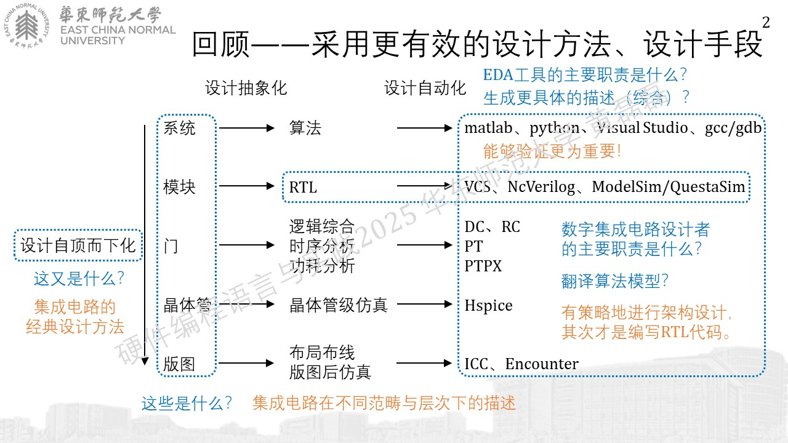

算法模型到RTL
........................................

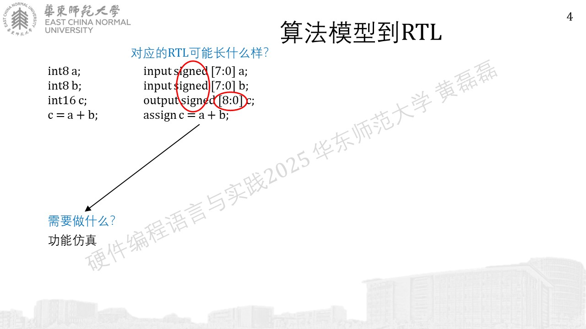
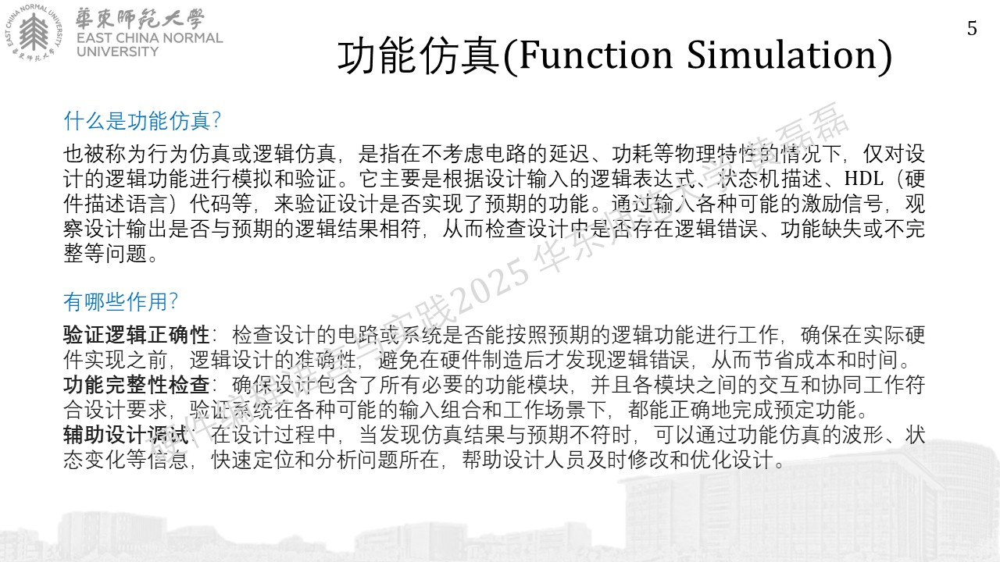
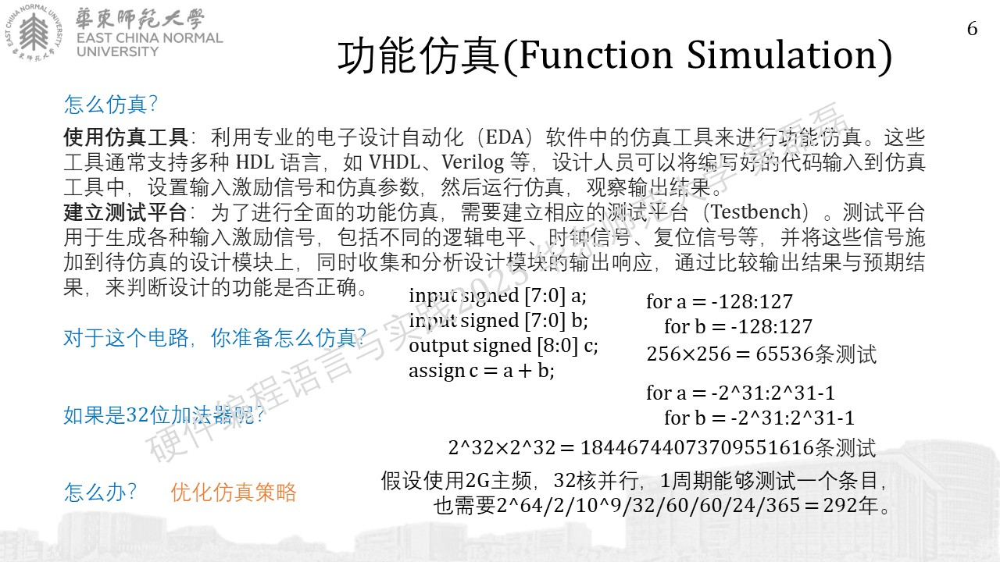
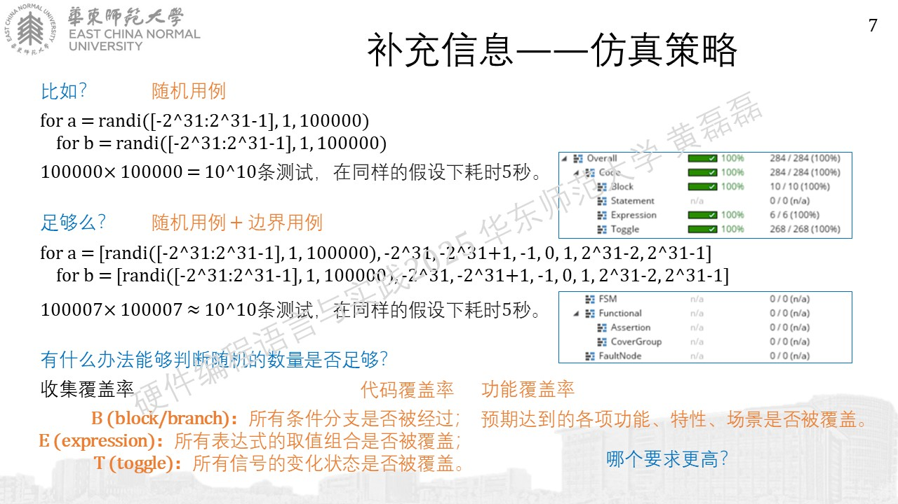

RTL到网表
........................................
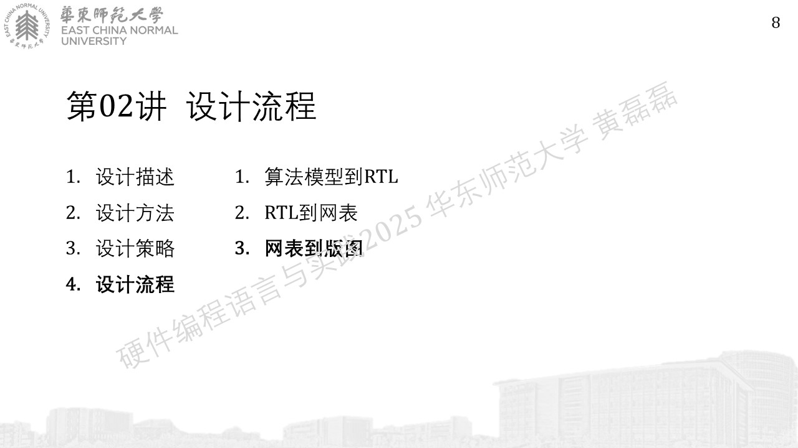
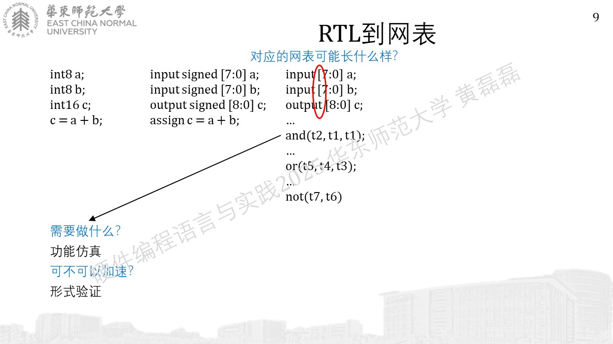
.. image:: 幻灯片10.JPG
.. image:: 幻灯片11.JPG
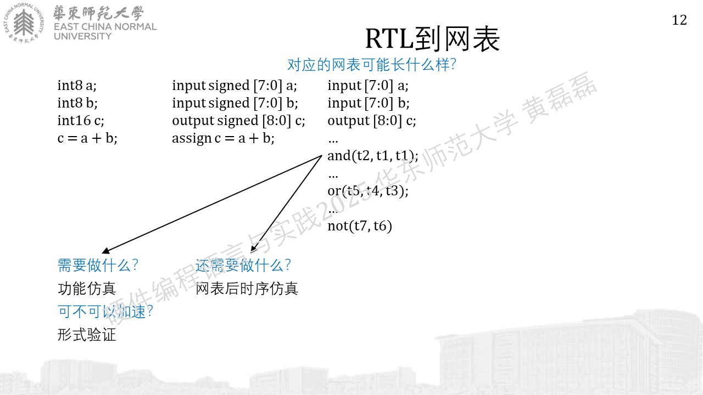
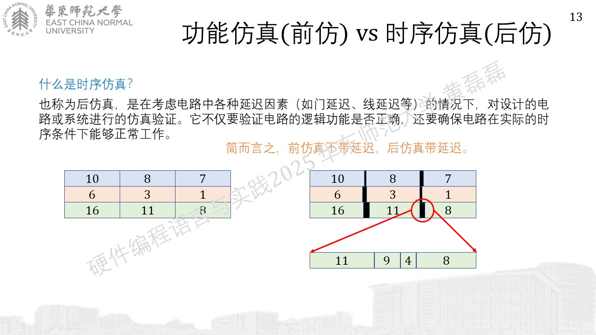
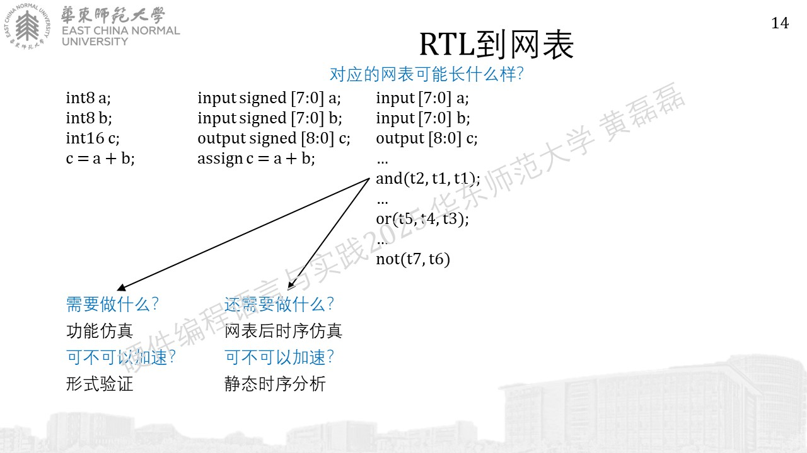
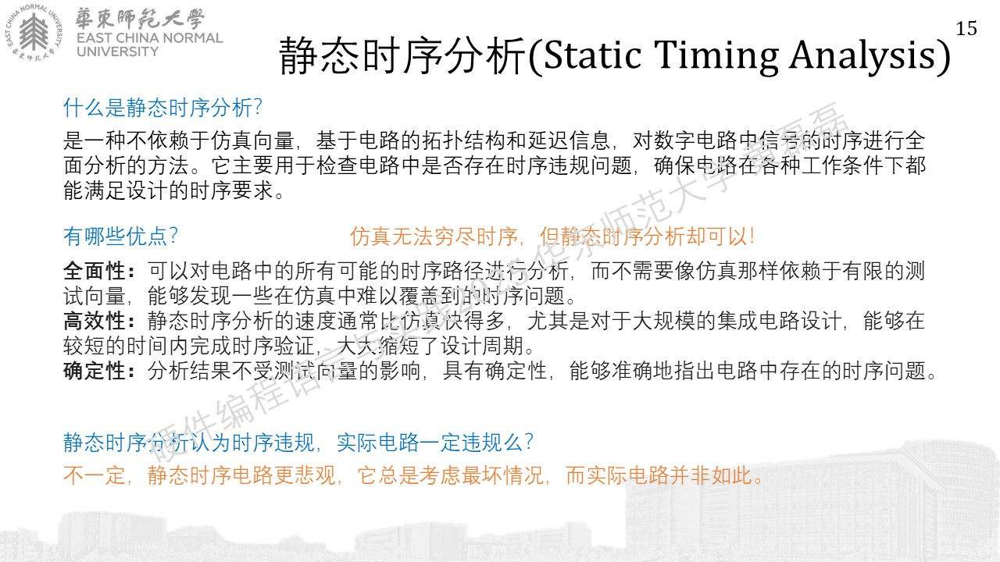
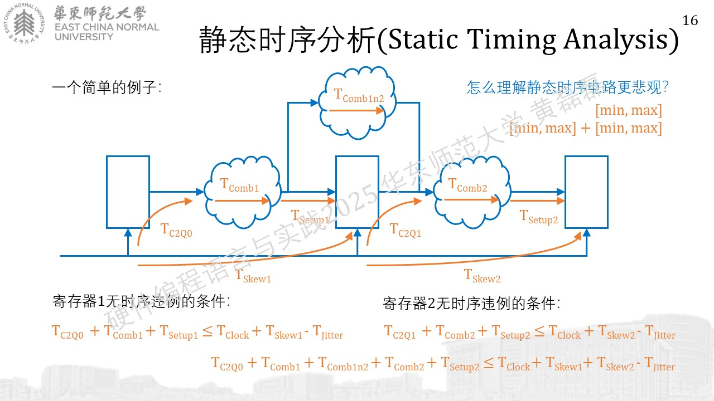
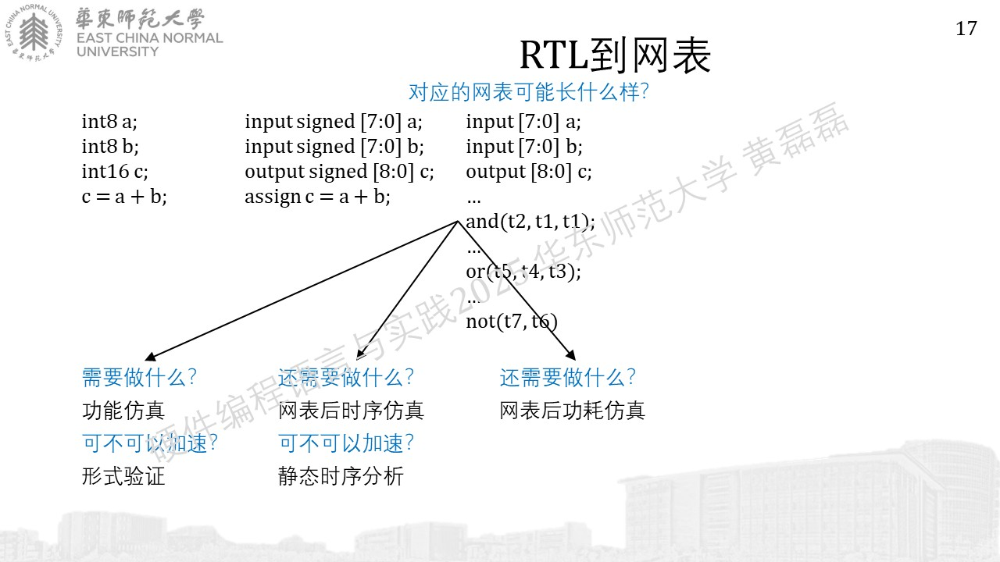

网表到版图
........................................
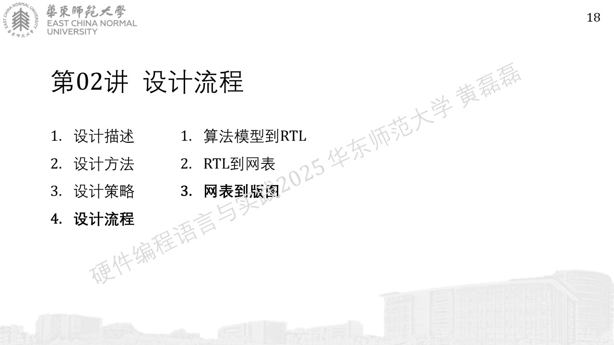
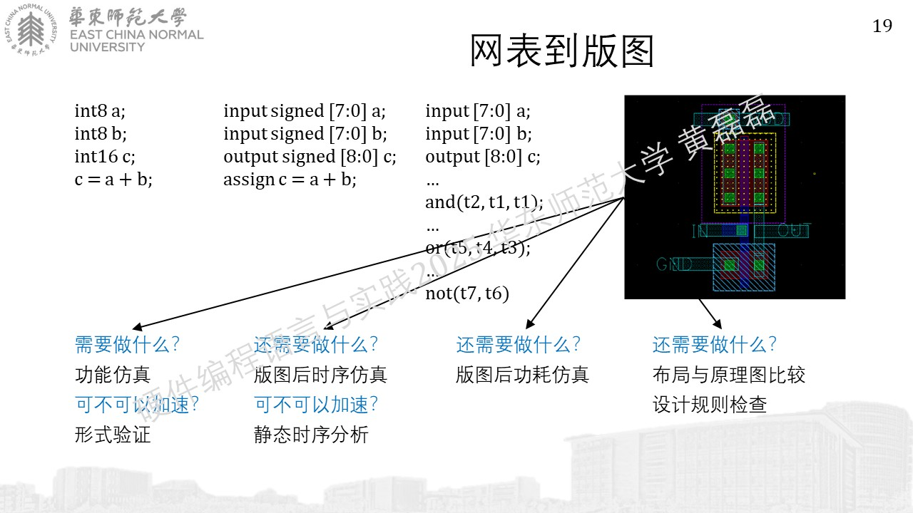
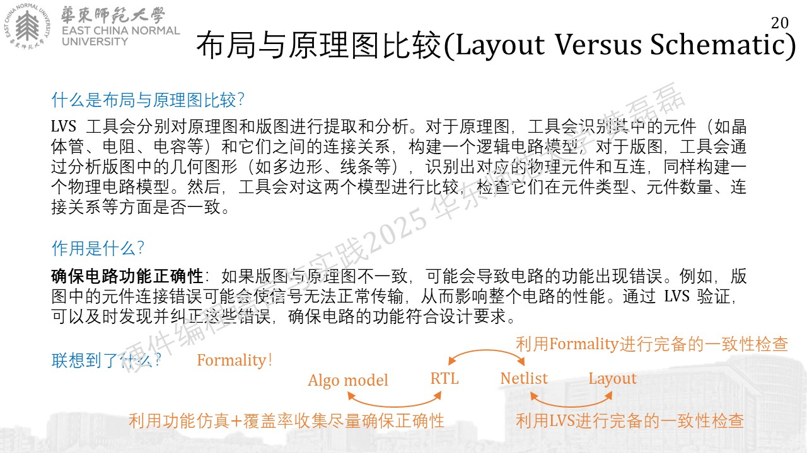
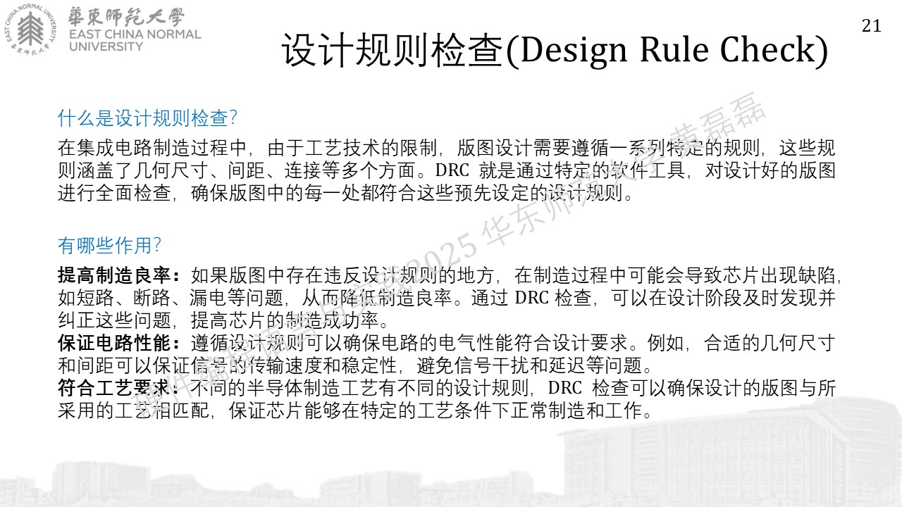

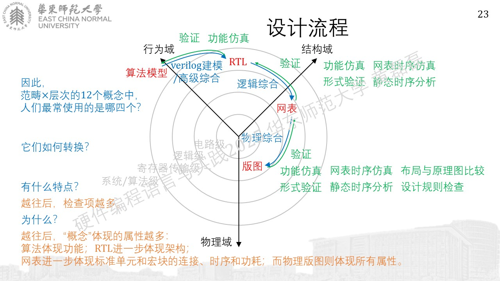

