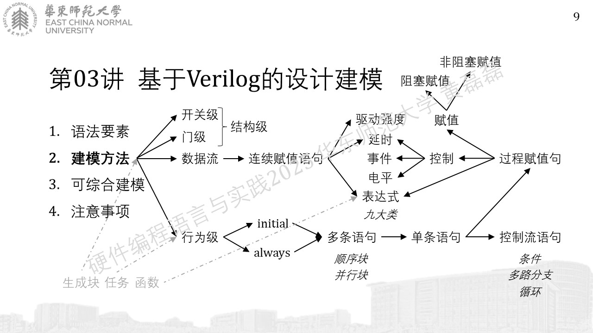

.. -----------------------------------------------------------------------------
   ..
   ..  Filename       : index.rst
   ..  Author         : Huang Leilei
   ..  Status         : phase 000
   ..  Created        : 2025-02-18
   ..  Description    : description about 第03讲 - 设计建模
   ..
.. -----------------------------------------------------------------------------

第03讲 - 设计建模
--------------------------------------------------------------------------------

https://fundamentals-of-digital-logic-2023.readthedocs.io/en/latest/%E6%95%B0%E5%AD%97%E9%80%BB%E8%BE%91%E5%9F%BA%E7%A1%80%20-%20%E7%AC%AC19%E8%AE%B2%20-%20Verilog%E8%AF%AD%E8%A8%80%20-%20%E8%AF%AD%E6%B3%95%E8%A6%81%E7%B4%A0/index.html

https://fundamentals-of-digital-logic-2023.readthedocs.io/en/latest/%E6%95%B0%E5%AD%97%E9%80%BB%E8%BE%91%E5%9F%BA%E7%A1%80%20-%20%E7%AC%AC20%E8%AE%B2%20-%20Verilog%E8%AF%AD%E8%A8%80%20-%20%E5%BB%BA%E6%A8%A1%E6%96%B9%E6%B3%95/index.html

https://fundamentals-of-digital-logic-2023.readthedocs.io/en/latest/%E6%95%B0%E5%AD%97%E9%80%BB%E8%BE%91%E5%9F%BA%E7%A1%80%20-%20%E7%AC%AC21%E8%AE%B2%20-%20Verilog%E8%AF%AD%E8%A8%80%20-%20%E5%8F%AF%E7%BB%BC%E5%90%88%E5%BB%BA%E6%A8%A1/index.html

https://fundamentals-of-digital-logic-2023.readthedocs.io/en/latest/%E6%95%B0%E5%AD%97%E9%80%BB%E8%BE%91%E5%9F%BA%E7%A1%80%20-%20%E7%AC%AC22%E8%AE%B2%20-%20Verilog%E8%AF%AD%E8%A8%80%20-%20%E6%B3%A8%E6%84%8F%E4%BA%8B%E9%A1%B9/index.html

.. image:: 幻灯片13.JPG
