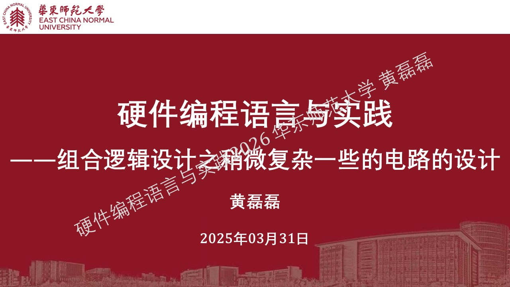
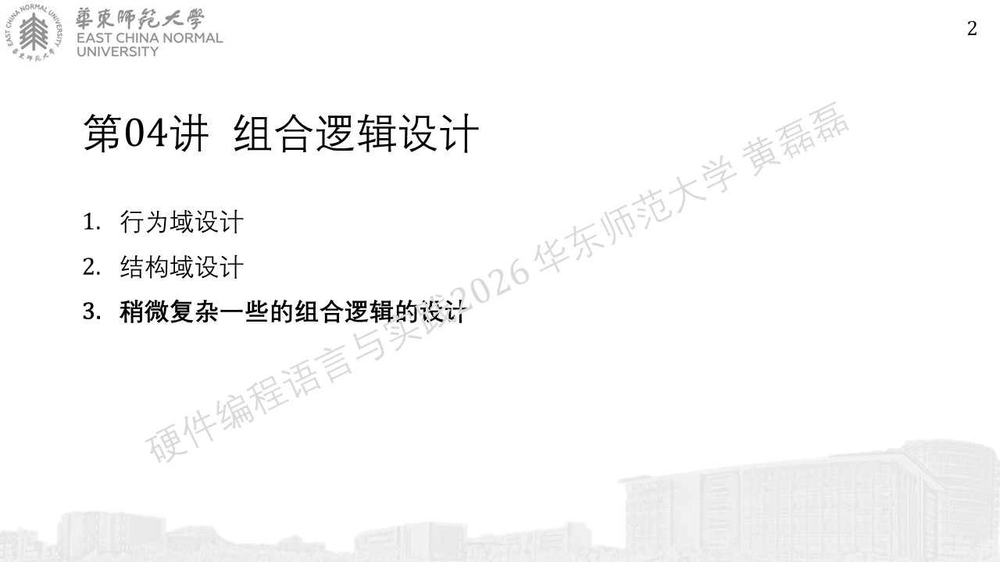
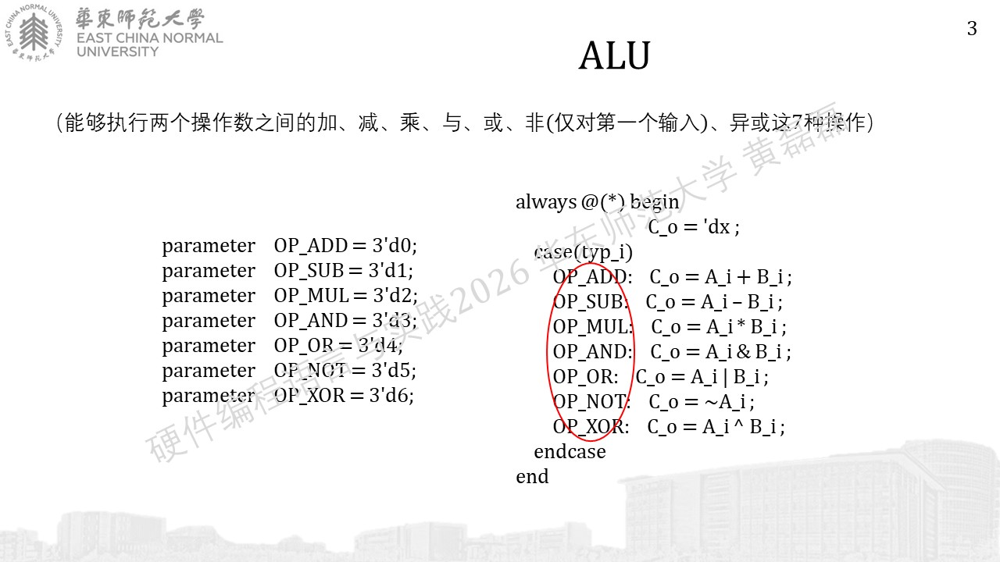
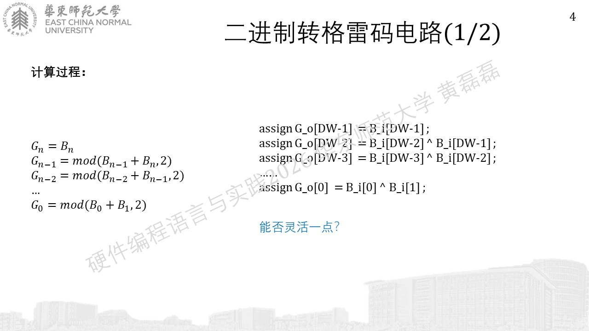
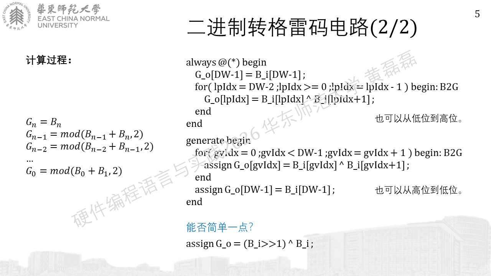

.. -----------------------------------------------------------------------------
   ..
   ..  Filename       : index.rst
   ..  Author         : Huang Leilei
   ..  Status         : phase 000
   ..  Created        : 2026-03-03
   ..  Description    : description about 第04讲 - 组合逻辑设计 - 稍微复杂一些的电路的设计
   ..
.. -----------------------------------------------------------------------------

第04讲 - 组合逻辑设计 - 稍微复杂一些的电路的设计
--------------------------------------------------------------------------------

ALU、B2G、G2B、ECC
........................................

未完待续...
