.. -----------------------------------------------------------------------------
   ..
   ..  Filename       : index.rst
   ..  Author         : Huang Leilei
   ..  Status         : phase 000
   ..  Created        : 2026-03-03
   ..  Description    : description about 第09讲 - 常见IP - 实践内容
   ..
.. -----------------------------------------------------------------------------

第09讲 - 常见IP - 实践内容
--------------------------------------------------------------------------------

基于SP_SRAM的双工FIFO的设计思路
................................................................................
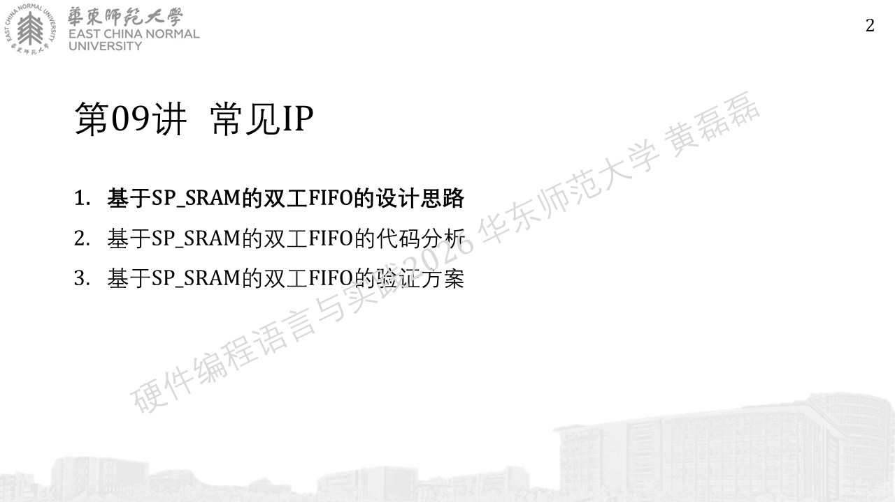
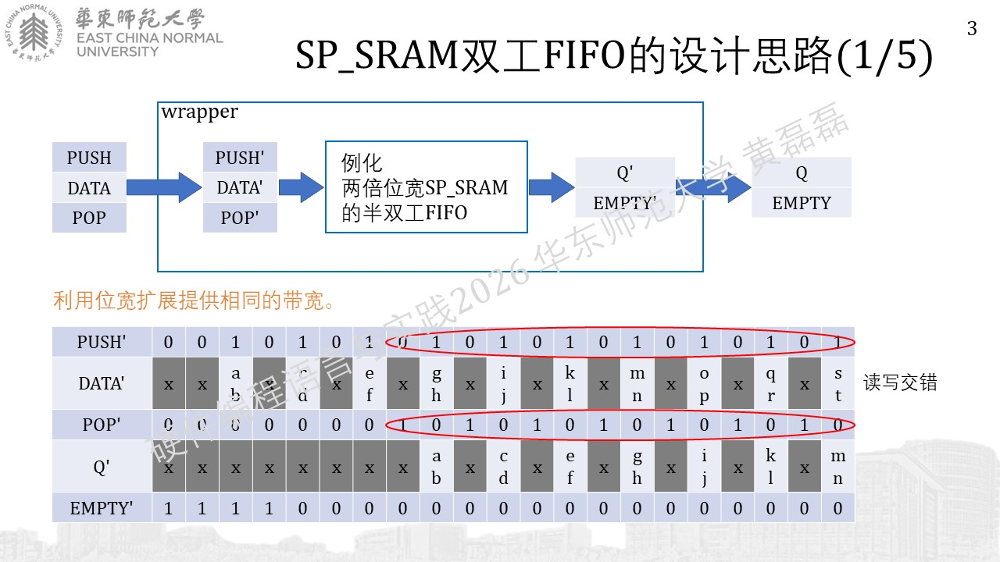
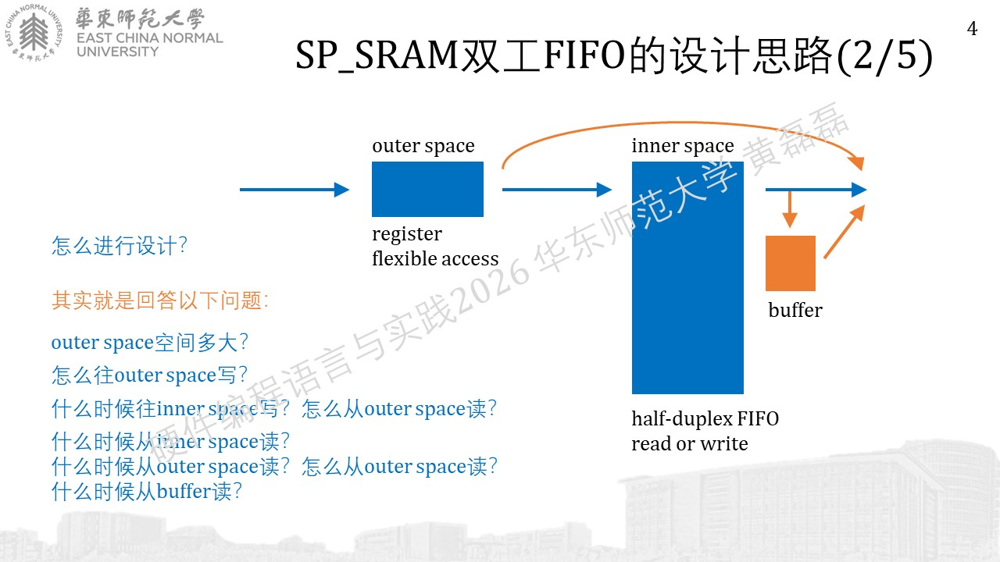
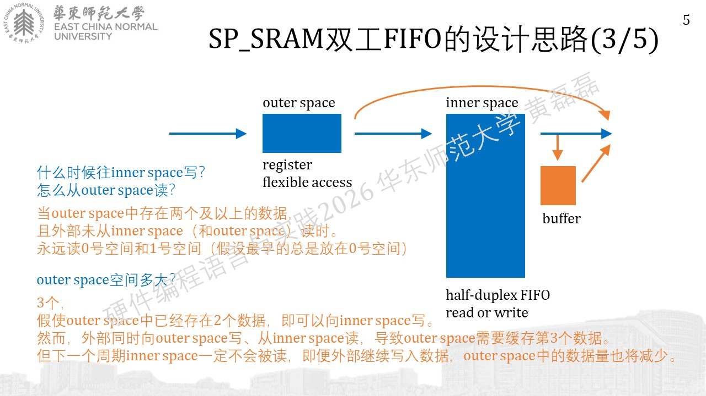
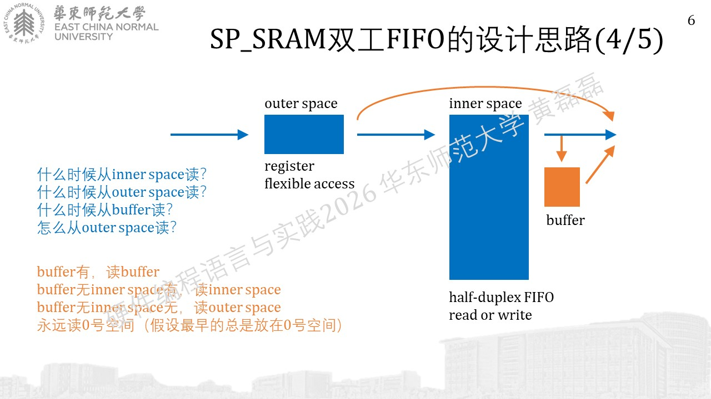
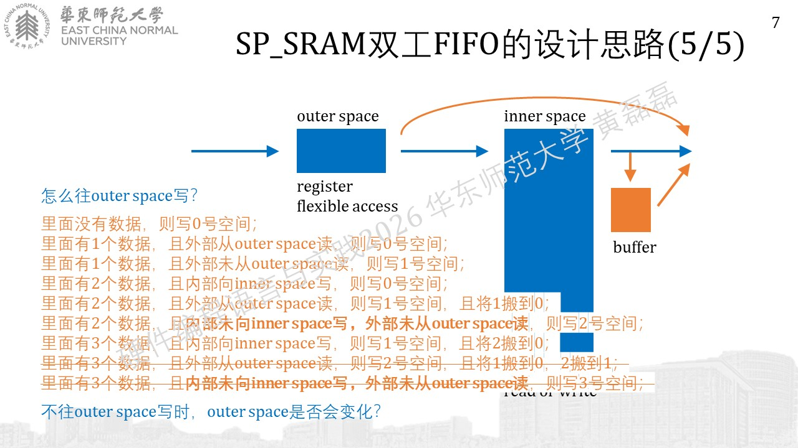

基于SP_SRAM的双工FIFO的代码分析
................................................................................
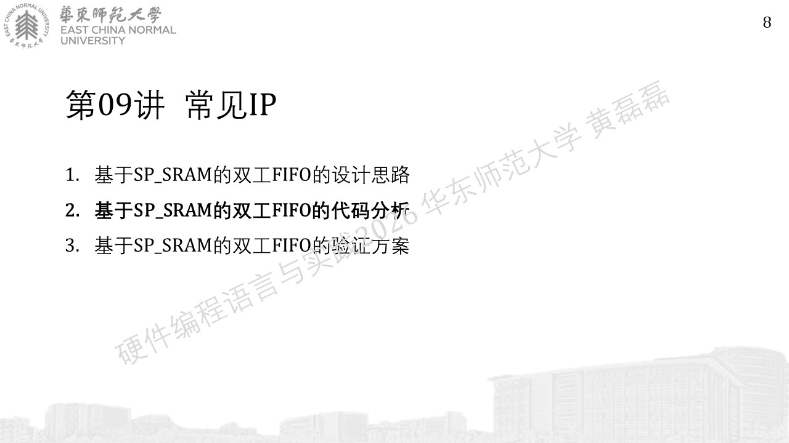
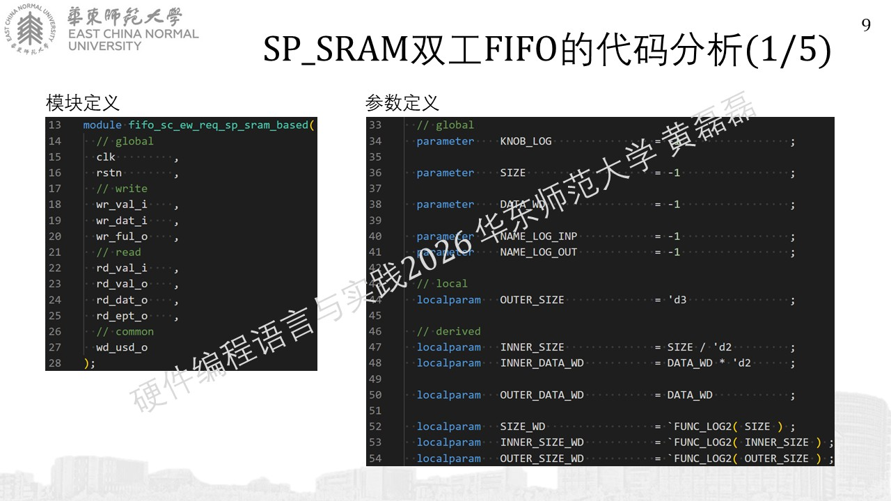
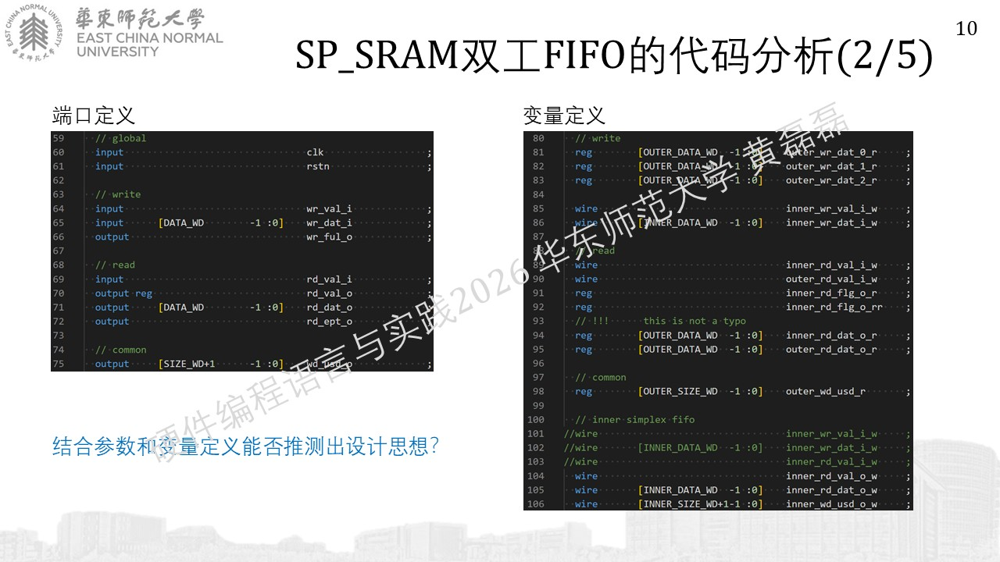
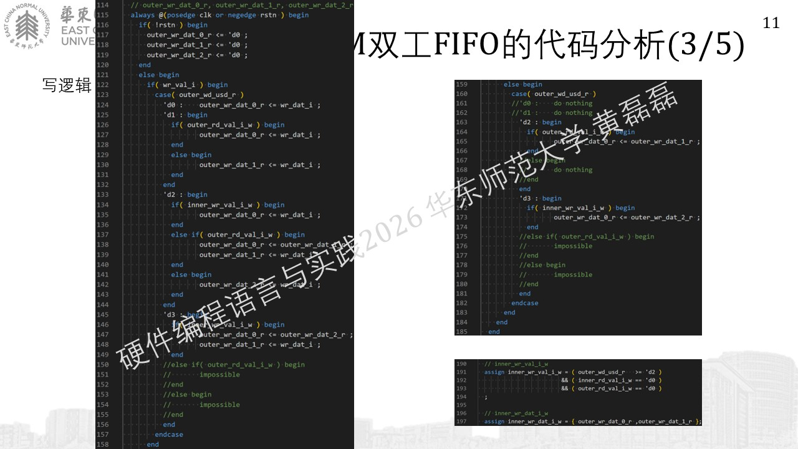
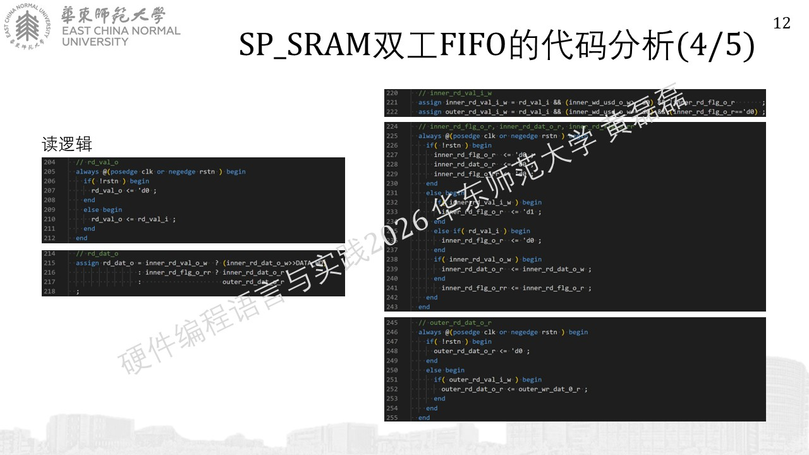
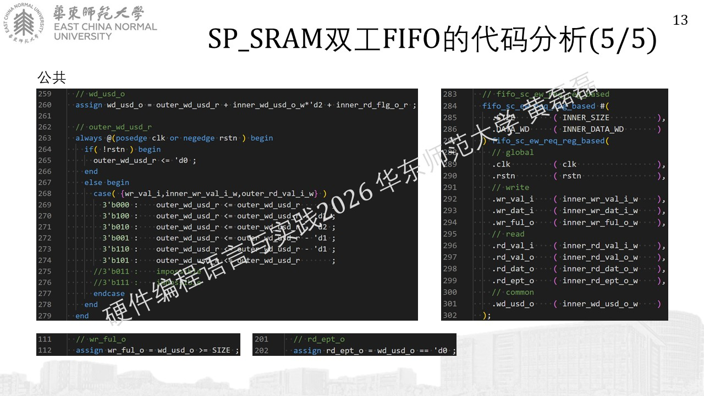

基于SP_SRAM的双工FIFO的设计思路
................................................................................
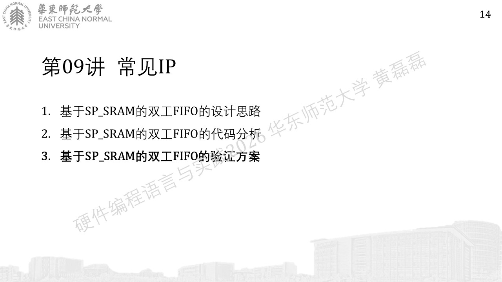
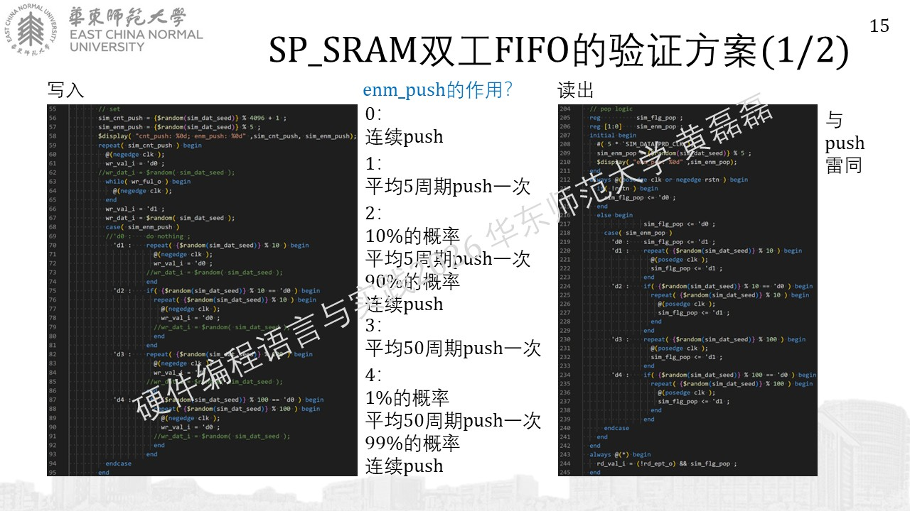
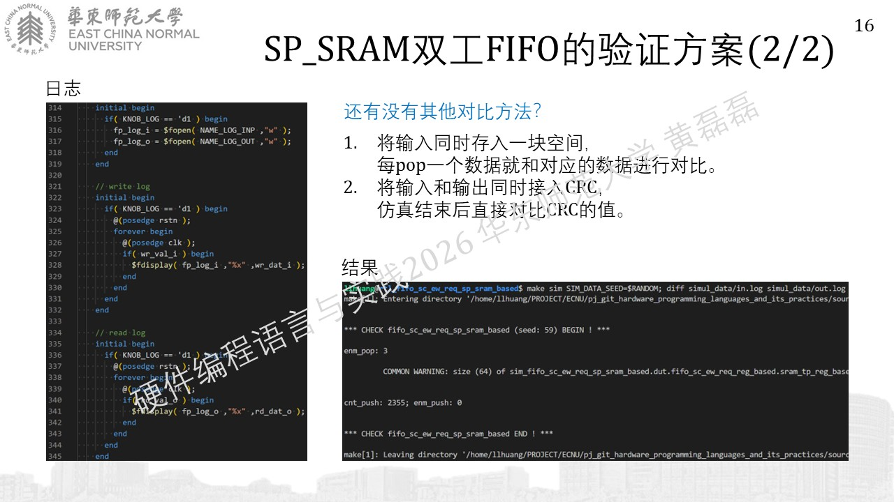

